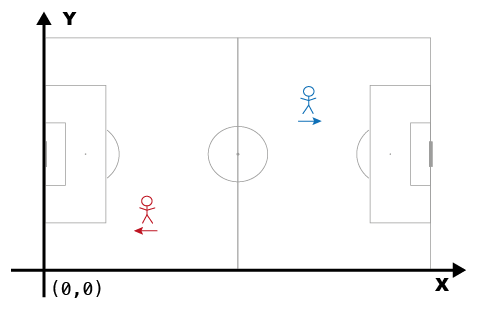

# Coordinates

There are notable differences in how various data providers manage the spatial aspect of the data. They all rely on Cartesian coordinate systems to indicate locations on the pitch. However, these coordinate systems differ in the location of the origin, the orientation of the axes, and the scaling of the axes. Another aspect is the orientation of the data: some providers represent all actions relative to a fixed attacking direction (e.g., always left to right), while others preserve the actual direction of play in each half, switching sides at halftime. In this section, we will first examine a few common spatial reference systems, discussing their advantages and disadvantages. Next, we explain how these systems are implemented in kloppy.

## Intro to spatial reference systems

Any attempt to describe a location on the football pitch requires a spatial reference system. In practice, this typically involves defining a two-dimensional Cartesian coordinate system, defining the dimensions of the pitch, and defining the direction of play.

In a Cartesian **coordinate system**, space is described using two perpendicular axes: the x-axis (typically representing a position along the length of the pitch) and the y-axis (typically representing a position along the width of the pitch). Each location on the pitch than corresponds to a pair of values (x, y), indicating its distance along each axis from a defined origin point. On a soccer pitch, the simplest way to establish a coordinate system is by placing the origin at the center of the field and aligning the y-axis vertically upward. With this setup, the center mark of the pitch corresponds to the coordinate (0, 0). Visually, it might look something like this:


In this coordinate system, interpreting a player's position is intuitive: if a player's coordinates are (22, 14) at some point, you know that they are located 22 units right and 14 units above the center of the pitch. However, knowing the unit of measurement (meters, centimeters, or yards) is essential to be able to interpret these coordinates.

Another common approach is to align the origin with the top-left or bottom-left corner of the pitch. This ensures all coordinates are positive, unless the player moves outside the pitch boundaries. Here is an example:



This highlights a second important aspect: **pitch dimensions**. The coordinate system itself does not specify whether a player is in or out of bounds. To clarify, imagine a player is standing at (120,0). Unless you know the actual length of the pitch (i.e., the max value along the x-dimension),[^1] you can’t tell if the player is inside or outside the pitch.

Things become more complex when analyzing data across matches played on pitches of varying dimensions. For instance, if you wish to analyze actions within predefined zones, those zones must be adjusted for each pitch format. To address this issue, many providers, particularly those offering event data, opt to standardize pitch dimensions. In standardized systems, all pitch data is projected onto a field of fixed dimensions. For example, kloppy's default pitch is represented as 1 unit long by 1 unit wide. No unit of measurement really applies here, but one can interpret the values as percentages. In this coordinate system, (0.5, 0.5) will always be at the center of the pitch.


Standardized pitch dimensions are convenient when comparing data across matches. It is problematic though if you want to compute anything that involves distances. All metric information gets distorted during standardization, and all related calculations require a mapping back to actual pitch sizes to be correct.

Additionally, since soccer involves teams switching sides at halftime, the **orientation** (i.e., direction of play) must also be considered. Some providers standardize the orientation so that all attacking actions occur in the same direction (e.g., left-to-right). Consider plotting all shots taken by a player in a season. If the data is standardized to always represent attacks in one direction, visualizations become much easier to interpret.


The above examples illustrate the most common approaches to represent locations in soccer match data. Each approach has its own advantages and limitations. Therefore, kloppy supports all of these spatial reference systems and makes it easy to transform data between them.

## Coordinate systems

### Components of a coordinate system

A coordinate system is fully defined by three components: an origin, a direction of the y-axis,[^2] and the pitch dimensions.
Each of these are represented with a dedicated core object.

##### Origin

The [`Origin`][kloppy.domain.Origin] defines the location of the (0, 0) coordinate on the pitch. Kloppy supports the following options:

- `Origin.TOP_LEFT` → Origin at the top-left corner of the field.
- `Origin.BOTTOM_LEFT` → Origin at the bottom-left corner of the field.
- `Origin.CENTER` → Origin at the center of the field.


##### VerticalOrientation

The [`VerticalOrientation`][kloppy.domain.VerticalOrientation] defines the orientation of the y-axis. Kloppy supports the following options:

- `VerticalOrientation.TOP_TO_BOTTOM` → The Y-axis increases as you move from the top to the bottom of the pitch.  
- `VerticalOrientation.BOTTOM_TO_TOP` → The Y-axis decreases as you move from the top to the bottom of the pitch.


##### PitchDimensions

A [`PitchDimensions`][kloppy.domain.PitchDimensions] entity fully describes the dimensions and markings of a pitch. This is how you create a 105-by-68 meter pitch with the standard dimensions according to the [IFAB regulations](https://www.theifab.com/laws/latest/the-field-of-play):

```python
from kloppy.domain import PitchDimensions, Dimension, Unit

pitch_dimensions = PitchDimensions(
    unit=Unit.METERS,
    standardized=False,
    # pitch boundaries
    x_dim=Dimension(min=0, max=105),
    y_dim=Dimension(min=0, max=68),
    # pitch markings
    goal_width=7.32,
    goal_height=2.44,
    six_yard_width=18.32,
    six_yard_length=5.5,
    penalty_area_width=40.32,
    penalty_area_length=16.5,
    penalty_spot_distance=11,
    penalty_arc_radius=9.15,
    circle_radius=9.15,
    corner_radius=1,
)
```

First, the `x_dim` and `y_dim` attributes specify the minimum and maximum value of coordinates inside the pitch boundaries along both axes. In this example, they specify that all x-coordinates in the range [0, 105] are within the pitch boundaries. If you don't know the size of the pitch, it's possible to use a `None` value for the bounds as in `Dimension(min=0, max=None)`. However, this will limit the transformations and analysis you can do on the data.

Furthermore, `unit` refers to the unit of measurement. Possible values are `"METERS"`, `"CENTIMETERS"`, `"YARDS"`, `"FEET"` or `"NORMED"`. The latter is a special value to indicate that no real unit applies to the pitch dimensions. This can be used with dimensions such as `Dimension(min=0, max=1)` or `Dimension(min=0, max=100)` that allow coordinates to be interpreted as a percentage.

The other attributes are related to the pitch markings. These are independent of the actual size of the pitch and should be specified in the same unit of measurement as the pitch boundaries.

One important thing to note is that the pitch dimensions used in the coordinate system are not necessarily tied to the actual physical dimensions of the pitch on which the match was played. This is particularly common in event data where most providers project events onto a standardized pitch (e.g., 105×68 meters or 100×100 units), regardless of the true field size. This makes it easier to compare data across matches, but introduces a disconnect between the coordinates and real-world distances. You can create such "standardized" pitch dimensions by setting the `standardized` attribute to `True`:

```python
from kloppy.domain import PitchDimensions, Dimension, Unit

pitch_dimensions = PitchDimensions(
    unit=Unit.METERS,
    standardized=True,
    # pitch boundaries
    x_dim=Dimension(min=0, max=105),
    y_dim=Dimension(min=0, max=68),
    # pitch markings
    goal_width=7.32,
    goal_height=2.44,
    six_yard_width=18.32,
    six_yard_length=5.5,
    penalty_area_width=40.32,
    penalty_area_length=16.5,
    circle_radius=9.15,
    corner_radius=1,
    penalty_spot_distance=11,
    penalty_arc_radius=9.15,
    # actual pitch size
    pitch_length=111,
    pitch_width=72
)
```

For standardized pitches, you can optionally specify the actual `pitch_length` and `pitch_width` if these are known. When these are provided, kloppy will use these when computing distances. Otherwise, a default pitch size of 105x68 meter will be assumed, which implies that distances might be slightly inaccurate.

As it can be cumbersome to specify all pitch markings, kloppy defines a couple of common pitch configurations:

- [`MetricPitchDimensions`][kloppy.domain.MetricPitchDimensions]: The standard pitch dimensions in meters by [IFAB regulations](https://www.theifab.com/laws/latest/the-field-of-play). The length of the pitch can be between 90 and 120 meters, and the width can be between 45 and 90 meters. All other dimensions are fixed.
- [`ImperialPitchDimensions`][kloppy.domain.ImperialPitchDimensions]: The same standard pitch dimensions by [IFAB regulations](https://www.theifab.com/laws/latest/the-field-of-play) but in yards.
- [`NormalizedPitchDimensions`][kloppy.domain.NormalizedPitchDimensions]: The pitch dimensions are normalized to a unit square, where the length and width of the pitch are 1. All other dimensions are scaled accordingly from the `MetricPitchDimensions` based on the `pitch_length` and `pitch_width`. For example, for a pitch of 70m wide, the goal will be 7.32 / 70 = 0.1046 units wide.
- [`OptaPitchDimensions`][kloppy.domain.OptaPitchDimensions]: The standardized pitch dimensions used by Opta.
- [`WyscoutPitchDimensions`][kloppy.domain.WyscoutPitchDimensions]: The standardized pitch dimensions used by Wyscout.

| | [`MetricPitchDimensions`][kloppy.domain.MetricPitchDimensions] | [`ImperialPitchDimensions`][kloppy.domain.ImperialPitchDimensions] | [`NormalizedPitchDimensions`][kloppy.domain.NormalizedPitchDimensions] | [`OptaPitchDimensions`][kloppy.domain.OptaPitchDimensions] | [`WyscoutPitchDimensions`][kloppy.domain.WyscoutPitchDimensions] |
|---------------------------|----------------|-------------------|----------|---------------|-------------------|
| **Length**                | 90-120 m       | 100-130 yd        | 1 unit   | 100 units     | 100 units         |
| **Width**                 | 45-90 m        | 50-100 yd         | 1 unit   | 100 units     | 100 units         |
| **Goal Width**            | 7.32 m         | 8 yd              | -        | 9.6 units     | 12.0 units        |
| **Goal Area (Width)**     | 18.32 m        | 20 yd             | -        | 26.4 units    | 26.0 units        |
| **Goal Area (Length)**    | 5.5 m          | 6 yd              | -        | 5.8 units     | 6.0 units         |
| **Penalty Area (Width)**  | 40.32 m        | 44.1 yd           | -        | 57.8 units    | 62.0 units        |
| **Penalty Area (Length)** | 16.5 m         | 18 yd             | -        | 17.0 units    | 16.0 units        |
| **Center Circle Radius**  | 9.15 m         | 10 yd             | -        | 9.0 units     | 8.84 units        |


### Specifying a coordinate system
Coordinate systems can be defined in two ways: by using the default system of a specific data provider, or by specifying a custom coordinate system.


#### Built-in coordinate systems

You can retrieve the coordinate system of a particular provider in kloppy as follows:

```pycon exec="true" source="console" session="concept-coordinates"
>>> from kloppy.domain import build_coordinate_system, Provider, DatasetType
>>> coordinate_system = build_coordinate_system(
...     Provider.SPORTEC,
...     dataset_type=DatasetType.EVENT, 
...     pitch_length=105, pitch_width=68
... )
>>> print(coordinate_system)
```

The figure below gives an overview of all built-in coordinate systems with the location of the origin, orientation of the y-axis and the pitch dimensions.

<pre>{{ plot_coordinate_systems(cols=3) }}</pre>

#### Custom coordinate systems

Apart from the above data providers, kloppy also provides support to create a custom coordinate system using the [`CustomCoordinateSystem`][kloppy.domain.CustomCoordinateSystem] class.

```python
from kloppy.domain import CustomCoordinateSystem, Origin, VerticalOrientation, NormalizedPitchDimensions, Dimension

my_coordinate_system = CustomCoordinateSystem(
    origin=Origin.TOP_LEFT,
    vertical_orientation=VerticalOrientation.TOP_TO_BOTTOM,
    pitch_dimensions=NormalizedPitchDimensions(
        pitch_length=105,
        pitch_width=68,
    ),
)
```

## Orientations

In kloppy, the [`Orientation`][kloppy.domain.Orientation] defines the direction of play of each team within a dataset. The following orientations are supported:

| Orientation            | Description                                                                                                                                     |
|------------------------|-------------------------------------------------------------------------------------------------------------------------------------------------|
| `BALL_OWNING_TEAM`     | The team that is currently in possession of the ball plays from left to right.                                                                  |
| `ACTION_EXECUTING_TEAM`| The team that executes the action plays from left to right. Used in event stream data only. Equivalent to "BALL_OWNING_TEAM" for tracking data. |
| `HOME_AWAY`            | The home team plays from left to right in the first period. The away team plays from left to right in the second period.                        |
| `AWAY_HOME`            | The away team plays from left to right in the first period. The home team plays from left to right in the second period.                        |
| `STATIC_HOME_AWAY`     | The home team plays from left to right in both periods.                                                                                         |
| `STATIC_AWAY_HOME`     | The away team plays from left to right in both periods.                                                                                         |
| `NOT_SET`              | The attacking direction is not defined.                                                                                                         |


The orientation is set at the dataset level, but individual records (e.g., frames or events) are interpreted relative to this configuration.
Here's how to load an event dataset, inspect its orientation, and determine the attacking direction of a specific event:

```pycon exec="true" source="console" session="concept-coordinates"
>>> from kloppy import statsbomb
>>> from kloppy.domain import Orientation

>>> dataset = statsbomb.load_open_data(match_id="3869685")

>>> # Check the current orientation
>>> print(dataset.metadata.orientation)

>>> # Inspect a single event
>>> event = dataset.events[42]
>>> print(f"{event.event_type} by {event.player.name} at position (x={event.coordinates.x:.2f}, y={event.coordinates.y:.2f})")

>>> # Determine the direction of attack for the event
>>> print("Attacking direction:", event.attacking_direction)
```

In this example:

- The dataset uses the `ACTION_EXECUTING_TEAM` orientation, meaning the team performing the action is considered to be attacking from left to right.
- The attribute `.attacking_direction` lets you query the direction of a specific event. It will be either `LTR` (meaning that the player who performs the action attacks from left to right) or `RTL` (meaning that the player who performs the action attacks from right to left).


[^1]: Pitch sizes are sometimes provided as metadata by the data provider. When this information is absent, a common approach is to assume a standard pitch size of 105 by 68 meters. However, it's worth noting that actual pitch lengths can vary significantly from 90 to 120 meters and widths from 45 to 90 meters. Therefore, this naive approach can introduce significant errors. Alternatively, the dimensions of the pitch can sometimes be estimated by analyzing corner kick positions.

[^2]: All commonly used coordinate systems orient the x-axis left-to-right. Only the orientation of the y-axis varies.
