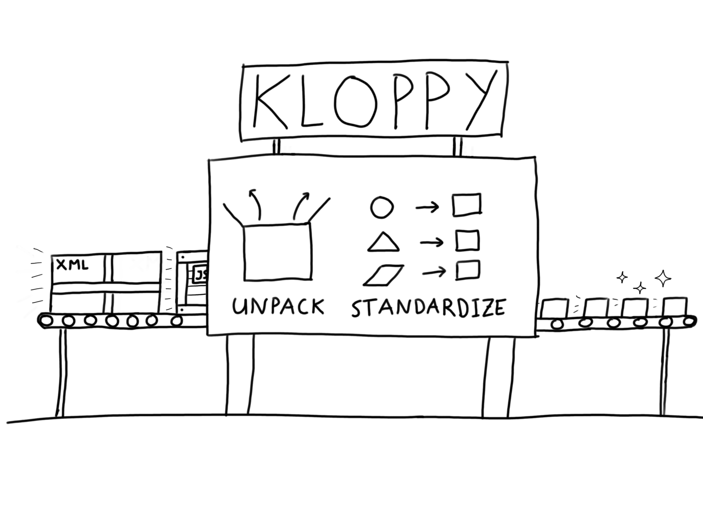

# Getting started

This chapter is here to help you get started quickly with kloppy. It gives a 10-minute introduction on how kloppy can be used to [load](#loading-data), [filter](#filtering-data), [transform](#transforming-data), and [export](#exporting-data) soccer match data. If you're already familiar with kloppy, feel free to skip ahead to the [next chapters](../installation/index.md) for a more in-depth discussion of all functionality.

## Installing kloppy

The recommended and easiest way to install kloppy is through `pip`.

```bash
pip install kloppy
```

The [installation guide](../installation/index.md) provides an overview of alternative options.

## Loading data

In soccer analytics, data typically comes in two main formats: [event data](../concepts/event-data/index.md) and [tracking data](../concepts/tracking-data/index.md). Each format has unique advantages and they are often used together.

Yet, within these main formats, there are notable differences between data providers in terms of the structure, naming conventions, and the depth of information available. This implies that significant patchwork and data plumbing is needed to repeat the same analysis for different data sources. Kloppy aims to eliminate these challenges by providing a set of data parsers that can load data from all common data providers into a common standardized format.



We'll illustrate how to load a dataset in this standardized format using a sample of [publicly available data provided by Sportec](https://www.nature.com/articles/s41597-025-04505-y). For examples on loading data from other data providers, see the [Loading Data](../loading-data/index.md) section of the user guide.

### Event data

The public Sportec dataset contains both event data and tracking data. We'll first load the event data.

```python exec="true" source="above" session="getting-started"
from kloppy import sportec

event_dataset = sportec.load_open_event_data(match_id="J03WN1")
```

The resulting [`EventDataset`][kloppy.domain.EventDataset] contains a list of [`Event`][kloppy.domain.Event] entities that represent actions such as passes, tackles, and shots. Each event is mapped to a specific subclass—e.g., shots become a [`ShotEvent`][kloppy.domain.ShotEvent], passes become a [`PassEvent`][kloppy.domain.PassEvent], and so on. These events are annotated with contextual information, including the players involved, the outcome of the action, and the location on the pitch where it occurred.

!!! note "A standardized event data model"

    Event data providers like Stats Perform, StatsBomb, and Wyscout have each developed their own event data catalogs, with unique definitions and categorizations for various event types. To address this lack of standardization, kloppy introduces its own [event data model](../../reference/event-data/index.md), which acts as a common denominator for event types and attributes used across data providers. This model facilitates the integration of data from diverse event data catalogs. If you need event types or data attributes that are not included in kloppy's datamodel, you can easily [extend the data model](../loading-data/index.md#event_factory).

You can retrieve specific events by their index or by their unique ID (as given by the data provider) using the [`.get_event_by_id()`][kloppy.domain.EventDataset.get_event_by_id] method. Below, we illustrate this by retrieving the opening goal in the match.

```pycon exec="true" source="console" session="getting-started"
>>> goal_event = event_dataset.get_event_by_id("18226900000272")
>>> print(goal_event)
```

Often, you will not know the exact index or ID of an event. In that case, you can use the [`.find()`][kloppy.domain.EventDataset.find] and [`.find_all()`][kloppy.domain.EventDataset.find_all] methods for finding the right events. You can pass a string or a function. In case of a string, it must be either '`<event_type>`', '`<event_type>`.`<result>`' or '.`<result>`'. Some examples: 'shot.goal', 'pass' or '.complete'. Let's look at how this works by finding all shots in the dataset.

```python exec="true" source="above" session="getting-started"
shot_events = event_dataset.find_all("shot")
goal_events = event_dataset.find_all("shot.goal")
```

On event-level there are also some useful methods for navigating: the [`.prev()`][kloppy.domain.Event.prev] and [`.next()`][kloppy.domain.Event.next] methods allow you to quickly find previous or next events. Those two methods also accept the same filter argument as the [`.find()`][kloppy.domain.EventDataset.find] and [`.find_all()`][kloppy.domain.EventDataset.find_all] methods, which can be useful to find a certain type of event instead of just the one before/after. For example, we can use it to find the assist for a goal.

```pycon exec="true" source="console" session="getting-started"
>>> assist_event = goal_event.prev("pass.complete")
>>> print(assist_event)
```

Using the wonderful [`mplsoccer`](https://mplsoccer.readthedocs.io/) package we can now plot the goal and its assist.

```python exec="true" source="tabbed-right" html="true" session="getting-started"
import matplotlib.pyplot as plt
from mplsoccer import VerticalPitch
from kloppy.domain import PositionType

# Setup the pitch
pitch = VerticalPitch(
    half=True, goal_type='box', pad_bottom=-.2,
    line_color="#cfcfcf",
    line_zorder=1,
    pitch_type="metricasports",
    pitch_length=event_dataset.metadata.pitch_dimensions.pitch_length,
    pitch_width=event_dataset.metadata.pitch_dimensions.pitch_width,
)

# We will use mplsoccer's grid function to plot a pitch with a title axis.
fig, axs = pitch.grid(
    figheight=4, endnote_height=0,  # no endnote
    title_height=0.1, title_space=0.02,
    # Turn off the endnote/title axis. I usually do this after
    # I am happy with the chart layout and text placement
    axis=False,
    grid_height=0.83
)

# Plot the goal angle
pitch.goal_angle(
    1-assist_event.receiver_coordinates.x, 1-assist_event.receiver_coordinates.y,
    alpha=0.2, zorder=1.1, color='#cb5a4c', goal='right', ax=axs['pitch']
)
# Plot the assist
pitch.lines(
    1-assist_event.coordinates.x, 1-assist_event.coordinates.y,
    1-assist_event.receiver_coordinates.x, 1-assist_event.receiver_coordinates.y,
    lw=5, transparent=True, comet=True, cmap='Blues', zorder=1.2,
    label='Pass leading to shot', ax=axs['pitch']
)
# Plot the shot
pitch.scatter(
    1-assist_event.receiver_coordinates.x, 1-assist_event.receiver_coordinates.y,
    s=600, marker="football", zorder=1.3, label='Shot', ax=axs['pitch']
)

# Add a legend and title
legend = axs['pitch'].legend(loc='lower right', labelspacing=1.5)
for text in legend.get_texts():
    text.set_fontsize(10)
    text.set_va('center')

# Add a title
axs['title'].text(
    0.5, 0.5,
    f'{goal_event.time} - Goal by {goal_event.player} ({goal_event.team})',
    va='center', ha='center', color='black', fontsize=12
)

from io import StringIO  # markdown-exec: hide
buffer = StringIO()  # markdown-exec: hide
plt.savefig(buffer, format="svg")  # markdown-exec: hide
print(buffer.getvalue())  # markdown-exec: hide
```

### Tracking data

Unlike event data, which focuses on on-the-ball actions, tracking data provides continuous spatial information about all players and the ball. Below we load the tracking data of the same game.

```python exec="true" source="above" session="getting-started"
from kloppy import sportec

tracking_dataset = sportec.load_open_tracking_data(
    match_id="J03WN1",
    limit=30000  # optional: for efficiency, we only load the first 30 000 frames
)
```

This will create a [`TrackingDataset`][kloppy.domain.TrackingDataset], which contains a sequence of [`Frame`][kloppy.domain.Frame] entities.

```pycon exec="true" source="console" session="getting-started"
>>> first_frame = tracking_dataset[0]
>>> print(first_frame)
```

Each frame has a [`.ball_coordinates`][kloppy.domain.Frame.ball_coordinates] attribute that stores the coordinates of the ball and a [`.players_coordinates`][kloppy.domain.Frame.players_coordinates] attribute that stores the coordinates of each player.

```pycon exec="true" source="console" session="getting-started"
>>> print(f"Ball coordinates: (x={first_frame.ball_coordinates.x:.2f}, y={first_frame.ball_coordinates.y:.2f})")
>>> for player, coordinates in first_frame.players_coordinates.items():
...     print(f"{player} ({player.team}): (x={coordinates.x:.2f}, y={coordinates.y:.2f})")
```

A tracking data frame can provide useful context to an event as it shows the locations of all off-the-ball players. For example for a pass event, it can show which alternative passing options a player had. Unfortunately, matching the right tracking frame to an event can be challenging as recorded timestamps in event data are not always very precise. Luckily, Sportec has already done this matching for all shot events. Let's revisit the opening goal that we looked at earlier and see what additional context the tracking data can provide.

!!! note "Event-tracking synchronization"

    Implementing automated event to tracking data synchronization is on kloppy's roadmap. See [#61](https://github.com/PySport/kloppy/issues/61).

```python exec="true" source="above" session="getting-started"
# Match the goal event with its corresponding tracking frame
matched_frame_idx = goal_event.raw_event["CalculatedFrame"]
goal_frame = tracking_dataset.get_record_by_id(int(matched_frame_idx))
```

With [`mplsoccer`](https://mplsoccer.readthedocs.io/) we can plot the frame.

```python exec="true" source="tabbed-right" html="true" session="getting-started"
import matplotlib.pyplot as plt
from mplsoccer import VerticalPitch
from kloppy.domain import PositionType

# Setup the pitch
pitch = VerticalPitch(
    half=True, goal_type='box', pad_bottom=-0.2,
    line_color="#cfcfcf",
    line_zorder=1,
    pitch_type="metricasports",
    pitch_length=event_dataset.metadata.pitch_dimensions.pitch_length,
    pitch_width=event_dataset.metadata.pitch_dimensions.pitch_width,
)

# We will use mplsoccer's grid function to plot a pitch with a title axis.
fig, axs = pitch.grid(
    figheight=4, endnote_height=0,  # no endnote
    title_height=0.1, title_space=0.02,
    # Turn off the endnote/title axis. I usually do this after
    # I am happy with the chart layout and text placement
    axis=False,
    grid_height=0.83
)

# Plot the players
goal_scorer = goal_event.player
coordinates = {
  "shooter": {"x": [], "y": []},
  "attacker": {"x": [], "y": []},
  "defender": {"x": [], "y": []},
  "goalkeeper": {"x": [], "y": []},
}
for player, player_coordinates in goal_frame.players_coordinates.items():
    if player == goal_scorer:
        coordinates["shooter"]["x"].append(1-player_coordinates.x)
        coordinates["shooter"]["y"].append(1-player_coordinates.y)
    elif player.starting_position == PositionType.Goalkeeper:
        coordinates["goalkeeper"]["x"].append(1-player_coordinates.x)
        coordinates["goalkeeper"]["y"].append(1-player_coordinates.y)
    elif player.team == goal_scorer.team:
        coordinates["attacker"]["x"].append(1-player_coordinates.x)
        coordinates["attacker"]["y"].append(1-player_coordinates.y)
    else:
        coordinates["defender"]["x"].append(1-player_coordinates.x)
        coordinates["defender"]["y"].append(1-player_coordinates.y)

    # plot the jersey numbers
    pitch.annotate(
        player.jersey_no, (1-player_coordinates.x, 1-player_coordinates.y),
        va='center', ha='center', color='white',
        fontsize=10, ax=axs['pitch']
    )

# Plot the angle to the goal
pitch.goal_angle(coordinates["shooter"]["x"], coordinates["shooter"]["y"] , alpha=0.2, zorder=1.1, color='#cb5a4c', goal='right', ax=axs['pitch'])

# Plot the player coordinates
pitch.scatter(coordinates["shooter"]["x"], coordinates["shooter"]["y"], s=300, marker="football", label='Shooter', ax=axs['pitch'])
pitch.scatter(coordinates["attacker"]["x"], coordinates["attacker"]["y"], s=300, c='#727cce', label='Attacker', ax=axs['pitch'])
pitch.scatter(coordinates["defender"]["x"], coordinates["defender"]["y"], s=300, c='#5ba965', label='Defender', ax=axs['pitch'])
pitch.scatter(coordinates["goalkeeper"]["x"], coordinates["goalkeeper"]["y"], s=300, c='#c15ca5', label='Goalkeeper', ax=axs['pitch'])

# Add a legend
legend = axs['pitch'].legend(loc='lower left', labelspacing=1.5)
for text in legend.get_texts():
    text.set_fontsize(10)
    text.set_va('center')

# Add a title
axs['title'].text(
    0.5, 0.5,
    f'{goal_event.time} - Goal by {goal_event.player} ({goal_event.team})',
    va='center', ha='center', color='black', fontsize=12
)

from io import StringIO  # markdown-exec: hide
buffer = StringIO()  # markdown-exec: hide
plt.savefig(buffer, format="svg")  # markdown-exec: hide
print(buffer.getvalue())  # markdown-exec: hide
```

### Metadata

One of the main benefits of working with kloppy is that it loads metadata with each (event and tracking) dataset and makes it available in the dataset's [`.metadata`][kloppy.domain.Dataset.metadata] property.

```python exec="true" source="above" session="getting-started"
metadata = event_dataset.metadata
```

This metadata includes teams (name, ground, tactical formation, and provider ID) and players (name, jersey number, position, and provider ID). By default, the teams are stored in `metadata.teams` as a tuple where the first item is the home team and the second one is the away team.

```pycon exec="true" source="console" session="getting-started"
>>> home_team, away_team = metadata.teams
>>> print(f"{home_team} vs {away_team}")
```

From each [`Team`][kloppy.domain.Team] entity, you can then retrieve the line-up as a list of [`Player`][kloppy.domain.Player] entities.

```python exec="true" source="tabbed-left" result="text" session="getting-started"
home_team_players = []
for player in home_team.players:
    position = (
        player.starting_position.code
        if player.starting_position is not None
        else 'SUB'
    )
    description = f"{position}:{player} (#{player.jersey_no})"
    home_team_players.append(description)

print(home_team_players)
```

To select individual players, you can use the [`.get_player_by_id()`][kloppy.domain.Team.get_player_by_id], [`.get_player_by_jersey_number()`][kloppy.domain.Team.get_player_by_jersey_number] or [`.get_player_by_position()`][kloppy.domain.Team.get_player_by_position] methods. Below, we select Florian Wirtz by his Sportec ID ("DFL-OBJ-002GBK").

```pycon exec="true" source="console" session="getting-started"
>>> player = away_team.get_player_by_id("DFL-OBJ-002GBK")
>>> print(player.name)
```

The [`Team`][kloppy.domain.Team] and [`Player`][kloppy.domain.Player] entities also contain the magic methods to use those keys in dictionaries or use them in sets. This makes it easy to do some calculations, and show the results without mapping the `player_id` to a name.

```python exec="true" source="tabbed-left" result="text" session="getting-started"
from collections import defaultdict

passes_per_player = defaultdict(list)
for event in event_dataset.find_all("pass"):
    passes_per_player[event.player].append(event)

print("\n".join(
    f"{player} has {len(passes)} passes"
    for player, passes in passes_per_player.items()
))
```

The metadata contains much more than the players and teams. Later in this quick start guide, we will come across some more metadata attributes. The [Reference Guide][kloppy.domain.Metadata] gives a complete overview of everything that is available.

## Filtering data

Oftentimes, not all data in a match is relevant. The goal of the analysis might be to investigate a certain time window, set of events, game phase, or tactical pattern.

### Selecting events or frames

To select a subset of events or frames, kloppy provides the [`filter`][kloppy.domain.Dataset.filter], [`find`][kloppy.domain.Dataset.find] and [`find_all`][kloppy.domain.Dataset.find_all] methods. We've already introduced the [`find`][kloppy.domain.Dataset.find] and [`find_all`][kloppy.domain.Dataset.find_all] methods above for finding events. The [`filter`][kloppy.domain.Dataset.filter] method works similarly, the only difference being that it returns a new dataset while the other two methods return a list of events or frames. With these methods we can easily create a dataset that only contains a specific type of event.

```python exec="true" source="above" session="getting-started"
# Create a new dataset which contains all goals
goals_dataset = event_dataset.filter('shot.goal')
```

We can do slightly more complicated things by providing a (lambda) function. This works for both event data and tracking datasets.

```python exec="true" source="above" session="getting-started"
# Create a new dataset with all frames where the ball is in the final third
pitch_max_x = tracking_dataset.metadata.pitch_dimensions.x_dim.max
f3_dataset = tracking_dataset.filter(
    lambda frame: frame.ball_coordinates.x > (2 / 3) * pitch_max_x
)
```

### Pattern matching

For finding patterns in a game (that is, groups of events), you can use kloppy's `event_pattern_matching` module. This module implements a versatile domain-specific language for finding patterns in event data, inspired by regular expressions. We won't get into detail here but rather show how it can be used to create [_movement chains_](https://www.statsperform.com/resource/introducing-movement-chains/) to illustrate its versatility.

Movement chains describe the pattern of four consecutive player involvements in an uninterrupted passage of play by displaying the locations of the first touches of the players involved, where a player can be involved more than once within the chain. In kloppy, you can define this pattern as follows:

```python exec="true" source="above" session="getting-started"
from kloppy import event_pattern_matching as pm

pattern = (
    # match all successful passes
    pm.match_pass(
        success=True,
        capture="first_touch"
    )
    # ... that are followed by 3 successful passes by the same team
    + pm.match_pass(
        success=True,
        team=pm.same_as("first_touch.team"),
    ) * 3
    # ... ending with a shot by the same team
    + pm.match_shot(
        team=pm.same_as("first_touch.team")
    )
)
```

Now, we can search for this pattern in an event dataset.

```pycon exec="true" source="console" session="getting-started"
>>> shot_ending_chains = pm.search(event_dataset, pattern)
>>> print(f"Found {len(shot_ending_chains)} matches")
```

We've only found two matches, one for the home team and one for the away team.
Let's take a closer look at the players involved in those shot-ending movement chains.

```pycon exec="true" source="console" session="getting-started"
>>> for match in shot_ending_chains:
...     print(" -> ".join([e.player.name for e in match.events]))
```

## Transforming data

Apart from the data format and event definitions, another aspect that differs between data providers is how they represent coordinates. These differences can include where the origin of the pitch is placed (e.g., top-left, center, bottom-left), which direction the axes increase (left to right, top to bottom, etc.), and the units used (normalized values, metric dimensions, or imperial dimensions). As a result, even if two datasets describe the same event, the x and y positions may not be directly comparable without converting them into a shared reference frame.

Sportec even uses different coordinate systems for their event and tracking data. For event data, the origin is at the top left, while it is at the center of the pitch for tracking data. The direction of the y-axis is different too.

<pre>{{
plot_coordinate_systems(
    providers = [
        {"provider": "sportec", "dataset_type": "EVENT"},
        {"provider": "sportec", "dataset_type": "TRACKING"},
    ],
    cols=2
)
}}</pre>

To avoid issues with differences between coordinate systems, kloppy converts all data to a common default coordinate system when loading a dataset: the [`KloppyCoordinateSystem`][kloppy.domain.KloppyCoordinateSystem].

```pycon exec="true" source="console" session="getting-started"
>>> print(event_dataset.metadata.coordinate_system)
```

In this coordinate system the pitch is scaled to a unit square where the x-axis ranges from 0 (left touchline) to 1 (right touchline), and the y-axis ranges from 0 (bottom goal line) to 1 (top goal line). All spatial data are expressed relative to this 1×1 pitch.

<pre>{{ plot_coordinate_systems(providers=[{"provider": "kloppy"}], cols=2) }}</pre>

You can convert from this normalized system to any supported provider format using the `.transform(to_coordinate_system=...)` method, allowing interoperability with other tools or datasets.

```pycon exec="true" source="console"
>>> from kloppy import sportec
>>> from kloppy.domain import Provider
>>> event_dataset = (
...     sportec.load_open_event_data(match_id="J03WN1")
...     .transform(to_coordinate_system=Provider.SPORTEC)
... )
>>> print(event_dataset.metadata.coordinate_system)
```

Alternatively (and more efficiently) you can directly load the data in your preferred coordinate system by setting the `coordinates` parameter. For example, to load the data with Sportec's coordinate system:

```pycon exec="true" source="console"
>>> from kloppy import sportec
>>> from kloppy.domain import Provider
>>> event_dataset = sportec.load_open_event_data(
...     match_id="J03WN1",
...     coordinates=Provider.SPORTEC
... )
>>> print(event_dataset.metadata.coordinate_system)
```

Another aspect of how coordinates are represented is the orientation of the data. For this game, the default orientation setting is "away-home". This means, the away team plays from left to right in the first period. The home team plays from left to right in the second period.

```pycon exec="true" source="console" session="getting-started"
>>> print(metadata.orientation)
```

This orientation reflects the actual playing direction, which switches at half-time. It aligns with how the match appears on broadcast footage, making it convenient when synchronizing tracking or event data with video.

However, for some types of analysis, it can be more convenient to normalize the orientation so that one team (usually the team of interest) always attacks in the same direction (e.g., left-to-right). One concrete example is creating a heatmap of a player's actions. Let’s look at an example where we visualize the locations of all Florian Wirtz' his passes, first without transforming the orientation.

```python exec="true" source="tabbed-right" html="true" session="getting-started"
from mplsoccer import Pitch
from kloppy.domain import EventType

player = away_team.get_player_by_id("DFL-OBJ-002GBK")

player_events = event_dataset.filter(
    lambda event: event.event_type == EventType.PASS and event.player == player
)

def heatmap(xs, ys):
    pitch = Pitch(
        pitch_type=event_dataset.metadata.coordinate_system.to_mplsoccer(),
        line_zorder=2,
    )
    fig, ax = pitch.draw()
    ax.set_title(f"#{player.jersey_no} - {player.last_name} - {player.team.name}")
    pitch.kdeplot(xs, ys, ax=ax, cmap="YlOrRd", fill=True, levels=100)

xs = [event.coordinates.x for event in player_events if event.coordinates is not None]
ys = [event.coordinates.y for event in player_events if event.coordinates is not None]

heatmap(xs, ys)

from io import StringIO  # markdown-exec: hide
buffer = StringIO()  # markdown-exec: hide
plt.savefig(buffer, format="svg")  # markdown-exec: hide
print(buffer.getvalue())  # markdown-exec: hide
```

The heatmap shows activity spread over the entire pitch. This is because teams switch directions at halftime, and the data reflects that change.

We can transform the data so that direction of all on-the-ball actions is aligned left-to-right. Therefore, we'll use the "action-executing-team" orientation.

```pycon exec="true" source="console" session="getting-started"
>>> transformed_events = player_events.transform(to_orientation="ACTION_EXECUTING_TEAM")
>>> print(transformed_events.metadata.orientation)
```

Now, the heatmap makes a lot more sense.

```python exec="true" source="tabbed-right" html="true" session="getting-started"
xs = [
    event.coordinates.x for event in transformed_events if event.coordinates is not None
]
ys = [
    event.coordinates.y for event in transformed_events if event.coordinates is not None
]

heatmap(xs, ys)

from io import StringIO  # markdown-exec: hide
buffer = StringIO()  # markdown-exec: hide
plt.savefig(buffer, format="svg")  # markdown-exec: hide
print(buffer.getvalue())  # markdown-exec: hide
```

## Exporting data

Until now, we've worked with kloppy's object oriented data model. This format is well-suited to preprocess the data. However, to do some actual analysis of the data, it can often be more convenient and efficient to use dataframes or SportsCode XML.

### To a Polars/Pandas dataframe

kloppy allows you to export a dataset to a dataframe. Both Polars and Pandas are supported. You can use the following engines: `polars`, `pandas`, `pandas[pyarrow]`.

!!! note

    You'll first have to install [Pandas](https://pandas.pydata.org/docs/getting_started/install.html) or [Polars](https://docs.pola.rs/user-guide/installation/).

Simply calling `dataset.to_df()` results in a default output, but we can modify how the resulting dataframe looks as shown in the code below.

```python exec="true" source="above" session="getting-started"
df_shots_and_key_passes = (
    event_dataset
    # filter for shots
    .filter("shot")
    # put all shots on the same side of the pitch
    .transform(to_orientation="ACTION_EXECUTING_TEAM")
    # convert to dataframe
    .to_df(
        "player_id",
        lambda event: {
            "player_name": str(event.player),
            "is_goal": event.result.is_success,
        },
        "coordinates_*",
        key_pass=lambda event: str(event.prev("pass").player),
        team=lambda event: str(event.team),
        engine="pandas",
    )
)
```

```python exec="true" html="true" session="getting-started"
print(f"""
<div class="md-typeset__scrollwrap"><div class="md-typeset__table">
{df_shots_and_key_passes.head().to_html(index=False, border="0")}
</div></div>
""")
```

### To Sportscode XML

Sportscode XML is a format associated with [Hudl Sportscode](https://www.hudl.com/en_gb/products/sportscode), a popular platform for video analysis in sports. It integrates video clips with detailed tagging of game events, making it ideal for coaches and analysts who need synchronized video and event data to dissect team and player performances.

To support this popular data format, kloppy provides a [`CodeDataset`][kloppy.domain.CodeDataset]. You can use kloppy to load Sportscode XML files, but perhaps more interestingly, you can also generate these files from another dataset allowing you to automatically create playlists from event and/or tracking data that can be used by a video analyst. We will illustrate this by creating a playlist with all shots.

```python exec="true" source="above" session="getting-started"
from datetime import timedelta

from kloppy.domain import Code, CodeDataset, EventType

code_dataset = (
    CodeDataset
    .from_dataset(
        event_dataset.filter("shot"),
        lambda event: Code(
            code_id=None,  # make it auto increment on write
            code=event.event_name,
            period=event.period,
            timestamp=max(timedelta(seconds=0), event.timestamp - timedelta(seconds=7)),  # start 7s before the shot
            end_timestamp=event.timestamp + timedelta(seconds=5),  # end 5s after the shot
            labels={
                'Player': str(event.player),
                'Team': str(event.team)
            },

            # in the future, the next two won't be needed anymore
            ball_owning_team=None,
            ball_state=None,
            statistics=None
        )
    )
)
```

You can now export the dataset to an XML file.

```python exec="false"
from kloppy import sportscode

sportscode.save(code_dataset, "playlist.xml")
```
